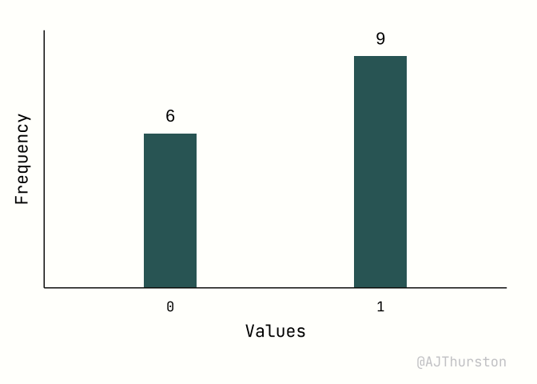
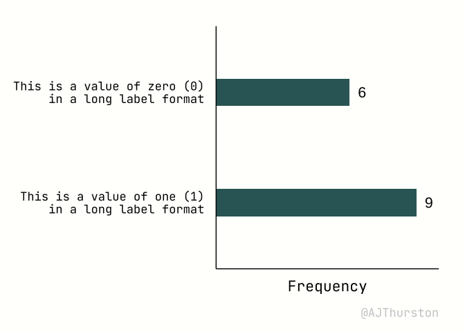
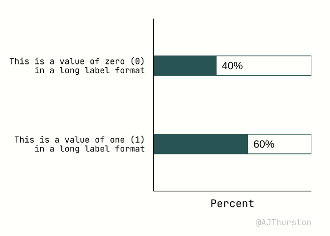

# Bar plots
AJ Thurston

## Setup

``` r
library(tidyverse)
library(ggplot2)
devtools::source_url("ajthurston.com/theme")
```

## Data

``` r
dat <- data.frame(values = as.factor(c(rep(0,6),rep(1,9))))
```

## Vertical Bar Plot

``` r
ggplot(dat, aes(x = values)) +
  geom_bar(fill = "#336666", width = .25) +
  geom_text(aes(label = after_stat(count)), stat = "count", size = 16/.pt, vjust = -1) +
  labs(x = "Values", y = "Frequency") +
  scale_y_continuous(limits = c(0,10), breaks = c(0:10), expand = c(0,0)) +
  theme_custom() +
    theme(axis.text.y = element_blank()
  )
```



## Recoding Data

Horizontal bar plots are useful when the variable values are long
strings of text.

The following recodes the dataset from numeric values 0 and 1 to
strings.

``` r
dat$values_name <- dat$values |>
  recode('0' = "This is a value of zero (0)\nin a long label format",
         '1' = "This is a value of one (1)\nin a long label format")
```

## Horizontal Bar Plot

Compare and contrast the vertical bar plot code above with the
horizontal bar plot code below. Note that the data is now explictly
plotted from the y-axis and frequencies are plotted on the x-axis.

``` r
ggplot(dat, aes(y = fct_rev(values_name))) +
  geom_bar(fill = "#336666", width = .25) +
  geom_text(aes(label = after_stat(count)), stat = "count", size = 16/.pt, hjust = -1) +
  labs(x = "Frequency", y = NULL) +
  scale_x_continuous(limits = c(0,10), breaks = c(0:10), expand = c(0,0)) +
  theme_custom() +
  theme(axis.text.x = element_blank()
        )
```



## Loading Bar Plot

A loading bar plot is a 100% stacked bar chart. Instead of displaying
raw counts, each bar is rescaled so that the total equals 100%. This
allows direct comparison of proportions across categories. The bars
resemble progress indicators, with segment widths corresponding to the
percentage share of each component. Whitespace is important here, as the
empty portion of the bar visually reinforces the gap between the
observed proportion and the full 100%.

``` r
dat_prop <- dat |>
  count(values_name) |>
  mutate(prop = n / sum(n)) |>
  mutate(label = scales::percent(prop, accuracy = 1))

ggplot(dat_prop, aes(x = prop, y = fct_rev(values_name))) +
  geom_col(aes(x = 1), fill = NA, color = "#336666", size = 16/.pt, width = .25) +
  geom_col(fill = "#336666", width = .25) +
  geom_text(aes(label = label), hjust = -.25) +
  scale_x_continuous(expand = c(0,0), limits = c(0,1)) +
  labs(x = "Percent", y = NULL) +
  theme_custom() +
  theme(
    axis.text.x = element_blank()
    )
```


