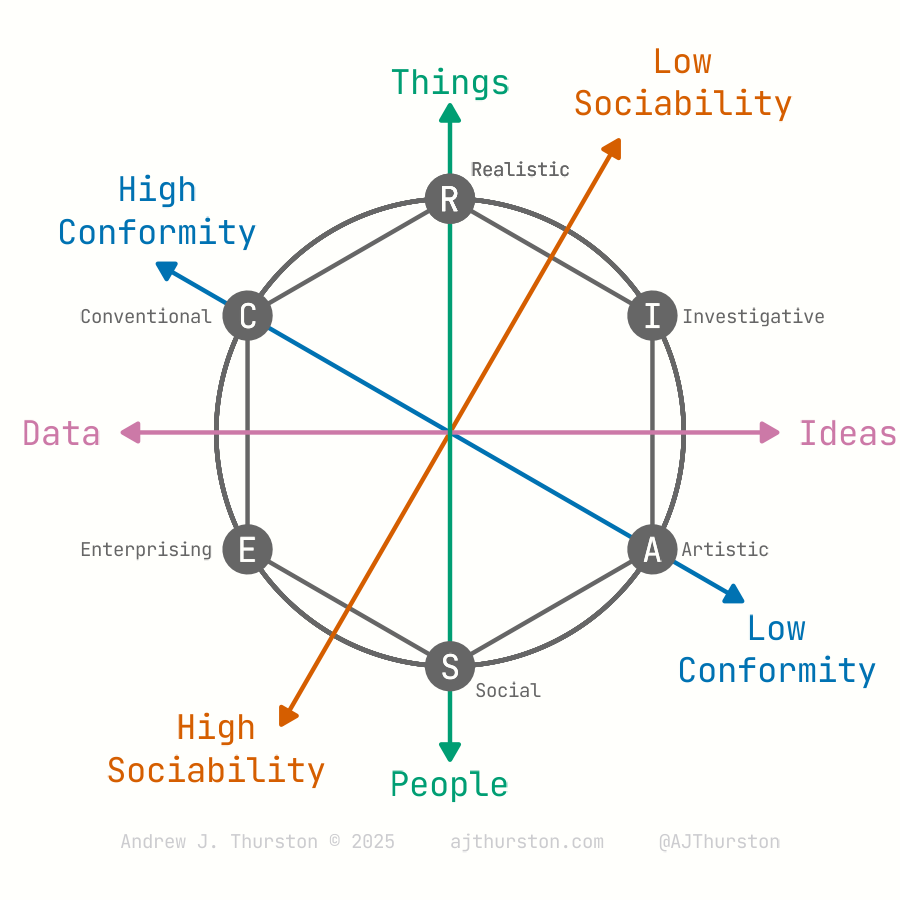
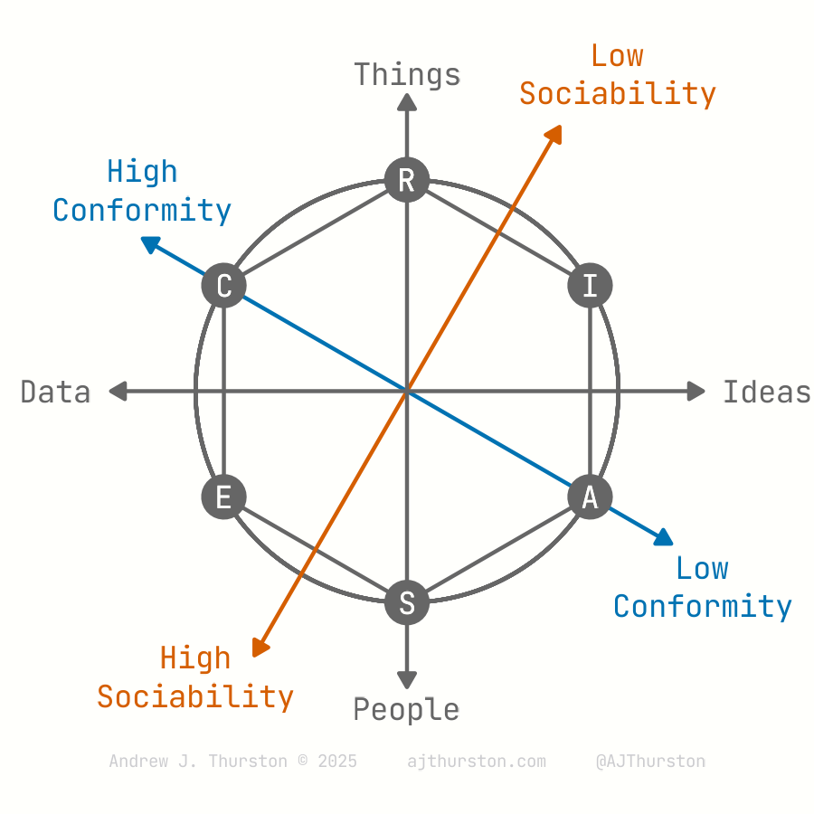

## RIASEC Full


## RIASEC Simplified


```{r}
library(ggplot2)
library(tidyverse)
library(ggforce)
source("https://ajthurston.com/theme")
okabeito <- c("#E69F00", "#56B4E9", "#009E73", "#F0E442", "#0072B2", "#D55E00", "#CC79A7", "#999999")
```


```{r}
riasec <- data.frame(
  code = c("R", "I", "A", "S", "E", "C"),
  label = c("Realistic", "Investigative", "Artistic",
            "Social", "Enterprising", "Conventional"),
  angle = seq(0, 300, by = 60) # 360° / 6
)

riasec <- riasec %>%
  mutate(
    angle_rad = (angle - 90) * pi/180,  # rotate so R starts at top
    x = cos(angle_rad),
    y = sin(angle_rad)*-1,
    x_label = c(.3,1.3,1.175,.25,-1.3,-1.3),
    y_label = c(1.125,.5,-.5,-1.1,-.5,.5)
  )

riasec_closed <- rbind(riasec, riasec[1,])
```

```{r}
# Circumplex plot
p <- ggplot(riasec_closed, aes(x, y)) +
  geom_circle(aes(x0 = 0, y0 = 0, r = 1), color = "#666666") +
  geom_polygon(fill = NA, color = "#666666") +
  annotate("segment",
           x = -1.25, y = 1.25/sqrt(3),
           xend = 1.25, yend = -1.25/sqrt(3),
           arrow = arrow(length = unit(0.15, "cm"), type = "closed", ends = "both"),
           color = "#0072B2"
           )+
  annotate("segment",
           x = -1.25 / sqrt(3),
           y = -1.25,
           xend = 1.25 / sqrt(3),
           yend = 1.25,
           arrow = arrow(length = unit(0.15, "cm"), type = "closed", ends = "both"),
           color = "#D55E00"
  )+
  annotate("segment",
           x = -1.4,
           y = 0,
           xend = 1.4,
           yend = 0,
           arrow = arrow(length = unit(0.15, "cm"), type = "closed", ends = "both"), color = "#CC79A7"
  )+
  annotate("segment",
           y = -1.4,
           x = 0,
           yend = 1.4,
           xend = 0,
           arrow = arrow(length = unit(0.15, "cm"), type = "closed", ends = "both"), color = "#009E73"
  )+
  annotate("text",
           y = 1.5,
           x = 0,
           label = "Things",
           size = 9,
           family = "jetbrains", color = "#009E73"
           
  )+
  annotate("text",
           y = -1.5,
           x = 0,
           label = "People",
           size = 9,
           family = "jetbrains", color = "#009E73"
           
  )+
  annotate("text",
           y = 0,
           x = -1.5,
           label = "Data",
           size = 9,
           family = "jetbrains",
           hjust  = 1, color = "#CC79A7"
           
  )+
  annotate("text",
           y = 0,
           x = 1.5,
           label = "Ideas",
           size = 9,
           family = "jetbrains",
           hjust = 0, color = "#CC79A7"
           
  )+
  annotate("text",
           x = -1.25, y = 1.4/sqrt(3),
           label = "High\nConformity",
           size = 9,
           family = "jetbrains",
           vjust = 0,
           color = "#0072B2",
           lineheight = 0.33
           
  )+
  annotate("text",
           x = 1.4, y = -1.35/sqrt(3),
           label = "Low\nConformity",
           size = 9,
           family = "jetbrains",
           vjust = 1,
           color = "#0072B2",
           lineheight = 0.33
           
  )+
  annotate("text",
           x = -1, y = -1.35,
           label = "High\nSociability",
           size = 9,
           family = "jetbrains",
           color = "#D55E00",
           lineheight = 0.33
           
  )+
  annotate("text",
           x = 1, y = 1.5,
           label = "Low\nSociability",
           size = 9,
           family = "jetbrains",
           color = "#D55E00",
           lineheight = 0.33
           
  )+
  annotate("text",
           x = 0, y = -1.75,
           label = "Andrew J. Thurston © 2025     ajthurston.com     @AJThurston",
           family = "jetbrains",
           color = "#CCCCCF",
           size = 5           
  )+
  scale_y_continuous(limits = c(-1.75,1.6)) +
  scale_x_continuous(limits = c(-1.75,1.75)) +
  geom_point(size = 5, color = "#666666") +
  geom_text(aes(label = code), size = 9, color = "#FFFFFC", family = "jetbrains") +
  geom_text(aes(label = code), size = 9, color = "#FFFFFC", family = "jetbrains") +
  geom_text(aes(x = x_label, y = y_label, label = label), size = 5, color = "#666666", family = "jetbrains") +
  coord_equal() +
  theme_void() +
  theme(  

    plot.background = element_rect(fill = "#FFFFFC", color = NA)
  )

ggsave(
  plot = p,
  file = "~/Desktop/riasec.png",
  units = "in",
  width = 3,
  height = 3,
  dpi = 300
)
```

## Simplified

```{r}
# Circumplex plot
p <- ggplot(riasec_closed, aes(x, y)) +
  geom_circle(aes(x0 = 0, y0 = 0, r = 1), color = "#666666") +
  geom_polygon(fill = NA, color = "#666666") +
  annotate("segment",
           x = -1.25, y = 1.25/sqrt(3),
           xend = 1.25, yend = -1.25/sqrt(3),
           arrow = arrow(length = unit(0.15, "cm"), type = "closed", ends = "both"),
           color = "#0072B2"
           )+
  annotate("segment",
           x = -1.25 / sqrt(3),
           y = -1.25,
           xend = 1.25 / sqrt(3),
           yend = 1.25,
           arrow = arrow(length = unit(0.15, "cm"), type = "closed", ends = "both"),
           color = "#D55E00"
  )+
  annotate("segment",
           x = -1.4,
           y = 0,
           xend = 1.4,
           yend = 0,
           arrow = arrow(length = unit(0.15, "cm"), type = "closed", ends = "both"), color = "#666666"
  )+
  annotate("segment",
           y = -1.4,
           x = 0,
           yend = 1.4,
           xend = 0,
           arrow = arrow(length = unit(0.15, "cm"), type = "closed", ends = "both"), color = "#666666"
  )+
  annotate("text",
           y = 1.5,
           x = 0,
           label = "Things",
           size = 9,
           family = "jetbrains", color = "#666666"
           
  )+
  annotate("text",
           y = -1.5,
           x = 0,
           label = "People",
           size = 9,
           family = "jetbrains", color = "#666666"
           
  )+
  annotate("text",
           y = 0,
           x = -1.5,
           label = "Data",
           size = 9,
           family = "jetbrains",
           hjust  = 1, color = "#666666"
           
  )+
  annotate("text",
           y = 0,
           x = 1.5,
           label = "Ideas",
           size = 9,
           family = "jetbrains",
           hjust = 0, color = "#666666"
           
  )+
  annotate("text",
           x = -1.25, y = 1.4/sqrt(3),
           label = "High\nConformity",
           size = 9,
           family = "jetbrains",
           vjust = 0,
           color = "#0072B2",
           lineheight = 0.33
           
  )+
  annotate("text",
           x = 1.4, y = -1.35/sqrt(3),
           label = "Low\nConformity",
           size = 9,
           family = "jetbrains",
           vjust = 1,
           color = "#0072B2",
           lineheight = 0.33
           
  )+
  annotate("text",
           x = -1, y = -1.35,
           label = "High\nSociability",
           size = 9,
           family = "jetbrains",
           color = "#D55E00",
           lineheight = 0.33
           
  )+
  annotate("text",
           x = 1, y = 1.5,
           label = "Low\nSociability",
           size = 9,
           family = "jetbrains",
           color = "#D55E00",
           lineheight = 0.33
           
  )+
  annotate("text",
           x = 0, y = -1.75,
           label = "Andrew J. Thurston © 2025     ajthurston.com     @AJThurston",
           family = "jetbrains",
           color = "#CCCCCF",
           size = 5           
  )+
  scale_y_continuous(limits = c(-1.75,1.6)) +
  scale_x_continuous(limits = c(-1.75,1.75)) +
  geom_point(size = 5, color = "#666666") +
  geom_text(aes(label = code), size = 9, color = "#FFFFFC", family = "jetbrains") +
  geom_text(aes(label = code), size = 9, color = "#FFFFFC", family = "jetbrains") +
  coord_equal() +
  theme_void() +
  theme(  

    plot.background = element_rect(fill = "#FFFFFC", color = NA)
  )

ggsave(
  plot = p,
  file = "~/Desktop/riasec_simplified.png",
  units = "in",
  width = 3,
  height = 3,
  dpi = 300
)
```


## Hogan's (1983) Orientation only

```{r}
riasec <- data.frame(
  code = c("R", "I", "A", "S", "E", "C"),
  label = c("Realistic", "Investigative", "Artistic",
            "Social", "Enterprising", "Conventional"),
  angle = seq(0, 300, by = 60) # 360° / 6
)

riasec <- riasec %>%
  mutate(
    angle_rad = (angle - 90) * pi/180,  # rotate so R starts at top
    x = cos(angle_rad),
    y = sin(angle_rad)*-1,
    x_label = c(0,1,1,0,-1,-1),
    y_label = c(1.2,.5,-.5,-1.2,-.5,.5),
    hjust = c(.5,0,0,.5,1,1)
  )

riasec_closed <- rbind(riasec, riasec[1,])
```

```{r}
# Circumplex plot
p <- ggplot(riasec_closed, aes(x, y)) +
  geom_circle(aes(x0 = 0, y0 = 0, r = 1), color = "#666666") +
  geom_polygon(fill = NA, color = "#666666") +
  annotate("segment",
           x = -1.25, y = 1.25/sqrt(3),
           xend = 1.25, yend = -1.25/sqrt(3),
           arrow = arrow(length = unit(0.15, "cm"), type = "closed", ends = "both"),
           color = "#0072B2"
           )+
  annotate("segment",
           x = -1.25 / sqrt(3),
           y = -1.25,
           xend = 1.25 / sqrt(3),
           yend = 1.25,
           arrow = arrow(length = unit(0.15, "cm"), type = "closed", ends = "both"),
           color = "#D55E00"
  )+
  annotate("text",
           x = -1.25, y = 1.4/sqrt(3),
           label = "High\nConformity",
           size = 9,
           family = "jetbrains",
           vjust = 0,
           color = "#0072B2",
           lineheight = 0.33
           
  )+
  annotate("text",
           x = 1.4, y = -1.35/sqrt(3),
           label = "Low\nConformity",
           size = 9,
           family = "jetbrains",
           vjust = 1,
           color = "#0072B2",
           lineheight = 0.33
           
  )+
  annotate("text",
           x = -1, y = -1.35,
           label = "High\nSociability",
           size = 9,
           family = "jetbrains",
           color = "#D55E00",
           lineheight = 0.33
           
  )+
  annotate("text",
           x = 1, y = 1.5,
           label = "Low\nSociability",
           size = 9,
           family = "jetbrains",
           color = "#D55E00",
           lineheight = 0.33
           
  )+
  annotate("text",
           x = 0, y = -1.75,
           label = "Andrew J. Thurston © 2025     ajthurston.com     @AJThurston",
           family = "jetbrains",
           color = "#CCCCCF",
           size = 5           
  )+
  scale_y_continuous(limits = c(-1.75,1.6)) +
  scale_x_continuous(limits = c(-1.75,1.75)) +
  geom_point(size = 5, color = "#666666") +
  geom_text(aes(label = code), size = 9, color = "#FFFFFC", family = "jetbrains") +
  geom_text(aes(label = code), size = 9, color = "#FFFFFC", family = "jetbrains") +
    geom_text(aes(x = x_label, y = y_label, label = label, hjust = hjust), size = 7.5, color = "#666666", family = "jetbrains") +
  coord_equal() +
  theme_void() +
  theme(  

    plot.background = element_rect(fill = "#FFFFFC", color = NA)
  )

ggsave(
  plot = p,
  file = "~/Desktop/riasec_hogan.png",
  units = "in",
  width = 3,
  height = 3,
  dpi = 300
)
```