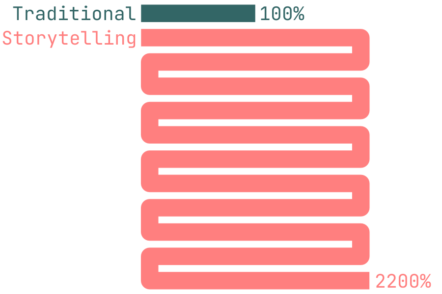
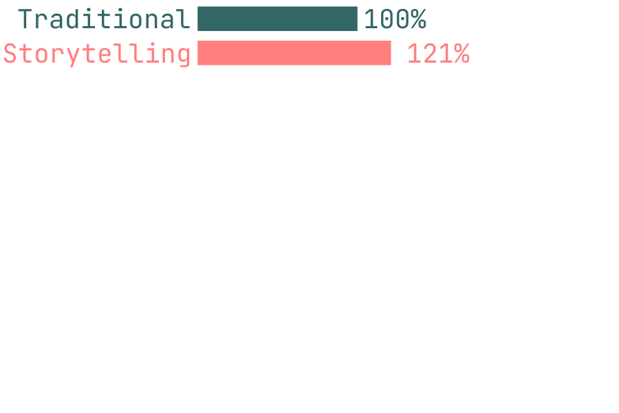

### Background

```{r}
library(ggplot2)
library(dplyr)
library(grid)
source("https://ajthurston.com/theme")
```

```{r}
library(ggplot2)
library(dplyr)

# Data
df <- data.frame(
  cat = c("A","B","C","D","E"),
  val = c(1200, 300, 850, 50, 4500)
)

t1 <- 500      # height per wrap
width <- 0.6   # width of a vertical section
gap   <- 0.6   # sideways shift when wrapping

# Function to compute polygon coordinates for one bar
build_bar <- function(x_center, value, t1, width, gap) {
  n_full <- floor(value / t1)
  rem    <- value %% t1
  
  # base x positions
  left  <- x_center - width/2
  right <- x_center + width/2
  
  polys <- list()
  y0 <- 0
  direction <- 1   # 1 = go right, -1 = go left
  for (k in seq_len(n_full)) {
    # rectangle height t1
    y1 <- y0 + t1
    if (direction == 1) {
      poly <- data.frame(
        x = c(left, right, right, left),
        y = c(y0, y0, y1, y1),
        id = paste0("wrap", k)
      )
    } else {
      # shifted left by 'gap'
      poly <- data.frame(
        x = c(left - gap, right - gap, right - gap, left - gap),
        y = c(y0, y0, y1, y1),
        id = paste0("wrap", k)
      )
    }
    polys[[k]] <- poly
    y0 <- y1
    direction <- direction * -1
  }
  # remainder at top
  if (rem > 0) {
    if (direction == 1) {
      poly <- data.frame(
        x = c(left, right, right, left),
        y = c(y0, y0, y0 + rem, y0 + rem),
        id = "tail"
      )
    } else {
      poly <- data.frame(
        x = c(left - gap, right - gap, right - gap, left - gap),
        y = c(y0, y0, y0 + rem, y0 + rem),
        id = "tail"
      )
    }
    polys[[length(polys) + 1]] <- poly
  }
  bind_rows(polys)
}

# Build polygon data for all bars
bars <- lapply(seq_len(nrow(df)), function(i) {
  poly <- build_bar(i, df$val[i], t1, width, gap)
  poly$cat <- df$cat[i]
  poly
}) |> bind_rows()

# Plot
ggplot(bars, aes(x = x, y = y, group = interaction(cat, id))) +
  geom_polygon(aes(fill = cat), color = "white") +
  coord_fixed(ratio = 1/500) +
  theme_minimal(base_size = 14) +
  scale_fill_brewer(palette = "Set2") +
  labs(title = "Wrapped Bar Chart (Du Bois style prototype)",
       x = NULL, y = "Value (wrapped scale)") +
  theme(legend.position = "none")


```


```{r}
library(ggplot2)
library(dplyr)

# Data
df <- data.frame(
  cat = c("A","B","C","D","E"),
  val = c(1200, 300, 850, 50, 4500)
)

t1 <- 500      # vertical height per wrap
width <- 0.6   # bar width
gap   <- 0.6   # sideways shift per wrap

# Function to build one "snake" bar that always moves right
build_bar <- function(x_center, value, t1, width, gap) {
  n_full <- floor(value / t1)
  rem    <- value %% t1
  
  left0  <- x_center - width/2
  right0 <- x_center + width/2
  
  polys <- list()
  y0 <- 0
  
  for (k in seq_len(n_full)) {
    offset <- (k - 1) * gap
    y1 <- y0 + t1
    poly <- data.frame(
      x = c(left0 + offset, right0 + offset,
            right0 + offset, left0 + offset),
      y = c(y0, y0, y1, y1),
      id = paste0("wrap", k)
    )
    polys[[k]] <- poly
    y0 <- y1
  }
  # remainder segment
  if (rem > 0) {
    offset <- n_full * gap
    poly <- data.frame(
      x = c(left0 + offset, right0 + offset,
            right0 + offset, left0 + offset),
      y = c(y0, y0, y0 + rem, y0 + rem),
      id = "tail"
    )
    polys[[length(polys) + 1]] <- poly
  }
  bind_rows(polys)
}

# Build polygons for all bars
bars <- lapply(seq_len(nrow(df)), function(i) {
  poly <- build_bar(i, df$val[i], t1, width, gap)
  poly$cat <- df$cat[i]
  poly
}) |> bind_rows()

# Plot
ggplot(bars, aes(x = x, y = y, group = interaction(cat, id))) +
  geom_polygon(aes(fill = cat), color = "white") +
  coord_fixed(ratio = 1/500) +
  theme_minimal(base_size = 14) +
  scale_fill_brewer(palette = "Set2") +
  labs(
    title = "Wrapped Bar Chart (One-Direction Coil)",
    x = NULL, y = "Value (wrapped scale)"
  ) +
  theme(legend.position = "none")

```

```{r}
library(ggplot2)
library(dplyr)

# Data
df <- data.frame(
  cat = c("A","B","C","D","E"),
  val = c(1200, 300, 850, 50, 4500)
)

t1 <- 500      # vertical scale (height of bar)
width <- 0.6   # bar thickness
gap   <- 0.6   # horizontal spacing between wraps

# Function: bar segments that always start at y = 0
build_bar <- function(x_center, value, t1, width, gap) {
  n_full <- floor(value / t1)
  rem    <- value %% t1
  
  left0  <- x_center - width/2
  right0 <- x_center + width/2
  
  polys <- list()
  
  for (k in seq_len(n_full)) {
    offset <- (k - 1) * gap
    poly <- data.frame(
      x = c(left0 + offset, right0 + offset,
            right0 + offset, left0 + offset),
      y = c(0, 0, t1, t1),
      id = paste0("wrap", k)
    )
    polys[[k]] <- poly
  }
  
  # remainder
  if (rem > 0) {
    offset <- n_full * gap
    poly <- data.frame(
      x = c(left0 + offset, right0 + offset,
            right0 + offset, left0 + offset),
      y = c(0, 0, rem, rem),
      id = "tail"
    )
    polys[[length(polys) + 1]] <- poly
  }
  
  bind_rows(polys)
}

# Build data for all categories
bars <- lapply(seq_len(nrow(df)), function(i) {
  poly <- build_bar(i, df$val[i], t1, width, gap)
  poly$cat <- df$cat[i]
  poly
}) |> bind_rows()

# Plot
ggplot(bars, aes(x = x, y = y, group = interaction(cat, id))) +
  geom_polygon(aes(fill = cat), color = "white") +
  coord_fixed(ratio = 1/500) +
  theme_minimal(base_size = 14) +
  scale_fill_brewer(palette = "Set2") +
  labs(
    title = "Wrapped Bar Chart (Each Segment Resets to Baseline)",
    x = NULL, y = "Segment Height"
  ) +
  theme(legend.position = "none")

```


```{r}
library(ggplot2)
library(dplyr)

# -------------------
# 1. Data
# -------------------
df <- data.frame(
  cat = c("A","B","C","D","E"),
  val = c(1200, 300, 850, 50, 4500)
)

t1 <- 500      # vertical height (per segment)
width <- 0.6   # bar width
gap   <- 0.6   # horizontal distance between wraps

# -------------------
# 2. Compute wraps and x-offsets
# -------------------
df2 <- df %>%
  mutate(
    n_wrap = floor(val / t1),
    tail   = val %% t1,
    n_seg  = n_wrap + ifelse(tail > 0, 1, 0)
  )

# cumulative horizontal offset so each category has space
df2 <- df2 %>%
  mutate(x_offset = cumsum(lag(n_seg * gap + 1, default = 0)))

# -------------------
# 3. Build bar polygons
# -------------------
build_bar <- function(x_start, value, t1, width, gap) {
  n_full <- floor(value / t1)
  rem    <- value %% t1
  
  left0  <- x_start - width/2
  right0 <- x_start + width/2
  
  polys <- list()
  
  for (k in seq_len(n_full)) {
    offset <- (k - 1) * gap
    poly <- data.frame(
      x = c(left0 + offset, right0 + offset,
            right0 + offset, left0 + offset),
      y = c(0, 0, t1, t1),
      id = paste0("wrap", k)
    )
    polys[[k]] <- poly
  }
  
  # remainder
  if (rem > 0) {
    offset <- n_full * gap
    poly <- data.frame(
      x = c(left0 + offset, right0 + offset,
            right0 + offset, left0 + offset),
      y = c(0, 0, rem, rem),
      id = "tail"
    )
    polys[[length(polys) + 1]] <- poly
  }
  
  bind_rows(polys)
}

bars <- lapply(seq_len(nrow(df2)), function(i) {
  poly <- build_bar(df2$x_offset[i] + i, df2$val[i], t1, width, gap)
  poly$cat <- df2$cat[i]
  poly
}) |> bind_rows()

# -------------------
# 4. Plot
# -------------------
ggplot(bars, aes(x = x, y = y, group = interaction(cat, id))) +
  geom_polygon(aes(fill = cat), color = "white") +
  theme_minimal(base_size = 14) +
  coord_fixed(ratio = 1/500) +
  scale_fill_brewer(palette = "Set2") +
  labs(
    title = "Wrapped Bar Chart (Non-Overlapping Categories)",
    x = NULL, y = "Value per Segment"
  ) +
  theme(legend.position = "none") +
  # optional category labels under each bar group
  geom_text(
    data = df2,
    aes(x = x_offset + seq_len(nrow(df2)),
        y = -50, label = cat),
    inherit.aes = FALSE,
    size = 5
  )

```

## Closest approximation using polys directly

```{r}
library(ggplot2)
library(dplyr)

# -------------------
# 1. Data
# -------------------
df <- data.frame(
  cat = c("A","B","C","D","E"),
  val = c(1200, 300, 850, 50, 4500)
)

t1 <- 500      # width per wrap (since now wrapping is vertical)
width <- 0.6   # bar thickness (horizontal)
gap   <- 0.6   # vertical gap between wraps

# -------------------
# 2. Compute wraps and offsets
# -------------------
df2 <- df %>%
  mutate(
    n_wrap = floor(val / t1),
    tail   = val %% t1,
    n_seg  = n_wrap + ifelse(tail > 0, 1, 0)
  )

# horizontal offset (now on y-axis) so categories don't overlap
df2 <- df2 %>%
  mutate(y_offset = cumsum(lag(n_seg * gap + 1, default = 0)))

# -------------------
# 3. Build vertically wrapped polygons (x/y swapped)
# -------------------
build_bar <- function(y_start, value, t1, width, gap) {
  n_full <- floor(value / t1)
  rem    <- value %% t1
  
  bottom <- y_start - width/2
  top    <- y_start + width/2
  
  polys <- list()
  
  for (k in seq_len(n_full)) {
    offset <- (k - 1) * gap
    poly <- data.frame(
      x = c(0, 0, t1, t1),
      y = c(bottom + offset, top + offset,
            top + offset, bottom + offset),
      id = paste0("wrap", k)
    )
    polys[[k]] <- poly
  }
  
  # remainder
  if (rem > 0) {
    offset <- n_full * gap
    poly <- data.frame(
      x = c(0, 0, rem, rem),
      y = c(bottom + offset, top + offset,
            top + offset, bottom + offset),
      id = "tail"
    )
    polys[[length(polys) + 1]] <- poly
  }
  
  bind_rows(polys)
}

bars <- lapply(seq_len(nrow(df2)), function(i) {
  poly <- build_bar(df2$y_offset[i] + i, df2$val[i], t1, width, gap)
  poly$cat <- df2$cat[i]
  poly
}) |> bind_rows()

# -------------------
# 4. Plot
# -------------------
ggplot(bars, aes(x = x, y = y, group = interaction(cat, id))) +
  geom_polygon(aes(fill = cat), color = "white") +
  theme_minimal(base_size = 14) +
  scale_fill_brewer(palette = "Set2") +
  labs(
    title = "Wrapped Bar Chart (Flipped Orientation, Non-Overlapping)",
    x = "Value (wrapped)", y = NULL
  ) +
  theme(legend.position = "none") +
  # Category labels to the left
  geom_text(
    data = df2,
    aes(x = -150, y = y_offset + seq_len(nrow(df2)), label = cat),
    inherit.aes = FALSE, size = 5, hjust = 1
  )


```

## This one is closer and uses geom, but obviously just a bar chart..

```{r}
library(ggplot2)
library(dplyr)

df <- data.frame(
  cat = c("A","B","C","D","E"),
  val = c(1200, 300, 850, 50, 4500)
)

t1 <- 500  # wrap threshold

wrapped_df <- df %>%
  rowwise() %>%
  do({
    n_wraps <- ceiling(.$val / t1)
    tibble(
      cat = .$cat,
      wrap = seq_len(n_wraps),
      segment_value = ifelse(wrap < n_wraps, t1, .$val - (n_wraps - 1) * t1)
    )
  }) %>%
  ungroup() %>%
    group_by(cat) %>%
  mutate(y = as.numeric(factor(cat)) + (wrap - 1) * 0.8) %>%
  ungroup()

ggplot(wrapped_df, aes(x = segment_value, y = cat, fill = cat)) +
  geom_col(width = 0.6, color = "white") +
  theme_minimal(base_size = 14) +
  scale_fill_brewer(palette = "Set2") +
  labs(title = "Tidy Wrapped Dataset — One Row per 500 Units",
       x = "Segment value (≤ 500 each)",
       y = NULL)


```

## This is much closer!

```{r}
library(ggplot2)
library(dplyr)

df <- data.frame(
  cat = c("A","B","C","D","E"),
  val = c(1200, 300, 850, 50, 4800)
)

t1 <- 1000  # wrap threshold

# --- build tidy wrapped data ---
wrapped_df <- df %>%
  rowwise() %>%
  do({
    n_wraps <- ceiling(.$val / t1)
    tibble(
      cat = .$cat,
      wrap = seq_len(n_wraps),
      segment_value = ifelse(wrap < n_wraps, t1,
                             .$val - (n_wraps - 1) * t1)
    )
  }) %>%
  ungroup() %>%
  mutate(
    # give each wrap a unique absolute row index for plotting
    wrap_index = row_number(),        # global index
    y_label = paste0(cat, "_", wrap)  # optional label like "A_1", "A_2", ...
  )

# --- plot: x always 0→500, y unique per wrap ---
ggplot(wrapped_df, aes(x = segment_value, y = reorder(y_label, desc(wrap_index)),
                       fill = cat)) +
  geom_col(width = 0.6, color = "white") +
  scale_x_continuous(limits = c(0, t1), expand = c(0, 0)) +
  theme_minimal(base_size = 14) +
  scale_fill_brewer(palette = "Set2") +
  labs(
    title = "Wrapped Bar Chart — Unique Y per Wrap, X Reset 0–500",
    x = "Segment value (0–500)",
    y = NULL
  ) +
  theme(
    legend.position = "none",
    panel.grid.minor = element_blank(),
    panel.grid.major.y = element_blank()
  )
```

New problem now: I need to get even number rows to start at the the threshold

```{r}
library(ggplot2)
library(dplyr)

df <- data.frame(
  cat = c("A","B","C","D","E"),
  val = c(1200, 300, 850, 50, 4800)
)

t1 <- 1000  # wrap threshold

# --- tidy wrapped data with alternating direction ---
wrapped_df <- df %>%
  rowwise() %>%
  do({
    n_wraps <- ceiling(.$val / t1)
    tibble(
      cat = .$cat,
      wrap = seq_len(n_wraps),
      segment_value = ifelse(wrap < n_wraps, t1,
                             .$val - (n_wraps - 1) * t1)
    )
  }) %>%
  ungroup() %>%
  mutate(
    # alternate direction: odd wraps normal, even wraps reversed
    x_start = if_else(wrap %% 2 == 1, 0, t1 - segment_value),
    x_end   = if_else(wrap %% 2 == 1, segment_value, t1),
    wrap_index = row_number(),
    y_label = paste0(cat, "_", wrap)
  )

# --- plot: even wraps flow backward, odd wraps forward ---
ggplot(wrapped_df, aes(y = reorder(y_label, desc(wrap_index)), fill = cat)) +
  geom_rect(
    aes(xmin = x_start, xmax = x_end, ymin = as.numeric(reorder(y_label, desc(wrap_index))) - 0.3,
        ymax = as.numeric(reorder(y_label, desc(wrap_index))) + 0.3),
    color = "white"
  ) +
  scale_x_continuous(limits = c(0, t1), expand = c(0, 0)) +
  theme_minimal(base_size = 14) +
  scale_fill_brewer(palette = "Set2") +
  labs(
    title = "Wrapped Bar Chart — Alternating Direction (Snake-Style)",
    x = "Value (0–500)",
    y = NULL
  ) +
  theme(
    legend.position = "none",
    panel.grid.minor = element_blank(),
    panel.grid.major.y = element_blank()
  )

```

## Using geom_path

```{r}
library(ggplot2)
library(dplyr)
library(purrr)

df <- data.frame(
  cat = c("A","B","C","D","E"),
  val = c(1200, 300, 850, 50, 4500)
)

t1 <- 500    # wrap threshold
r  <- 50     # arc radius
bar_h <- 0.3 # bar half height

# --- wrapped bars tidy data ---
bars <- df %>%
  rowwise() %>%
  do({
    n_wraps <- ceiling(.$val / t1)
    tibble(
      cat = .$cat,
      wrap = seq_len(n_wraps),
      segment_value = ifelse(wrap < n_wraps, t1,
                             .$val - (n_wraps - 1) * t1)
    )
  }) %>%
  ungroup() %>%
  mutate(
    x_start = if_else(wrap %% 2 == 1, 0, t1 - segment_value),
    x_end   = if_else(wrap %% 2 == 1, segment_value, t1),
    wrap_index = row_number(),
    y_label = paste0(cat, "_", wrap),
    y = as.numeric(factor(y_label))
  )

# --- helper to build semicircle arcs between wraps ---
make_arc <- function(y_mid, dir = "right", r = 50, n = 40) {
  theta <- seq(0, pi, length.out = n)
  if (dir == "right") {
    data.frame(
      x = t1 - r * (1 - cos(theta)),
      y = y_mid + r * sin(theta)
    )
  } else {
    data.frame(
      x = 0 + r * (1 - cos(theta)),
      y = y_mid + r * sin(theta)
    )
  }
}

# --- build arcs (fully tidy) ---
arc_df <- bars %>%
  arrange(cat, wrap) %>%
  group_by(cat) %>%
  mutate(y_next = lead(y)) %>%
  filter(!is.na(y_next)) %>%
  mutate(dir = if_else(wrap %% 2 == 1, "right", "left")) %>%
  group_modify(~{
    arc_pts <- make_arc(mean(c(.x$y, .x$y_next)), .x$dir[1], r)
    arc_pts$cat <- .x$cat[1]
    arc_pts$dir <- .x$dir[1]
    arc_pts
  }) %>%
  ungroup()

# --- plot bars + arcs ---
ggplot() +
  geom_rect(
    data = bars,
    aes(xmin = x_start, xmax = x_end,
        ymin = y - bar_h, ymax = y + bar_h, fill = cat),
    color = "white"
  ) +
  geom_path(
    data = arc_df,
    aes(x = x, y = y, group = cat, color = cat),
    size = 1.2,
    lineend = "round"
  ) +
  scale_x_continuous(limits = c(0, t1), expand = c(0, 0)) +
  theme_minimal(base_size = 14) +
  scale_fill_brewer(palette = "Set2") +
  scale_color_brewer(palette = "Set2") +
  labs(
    title = "Wrapped Bar Chart with Arcs (Du Bois Style)",
    x = "Value (0–500)",
    y = NULL
  ) +
  theme(
    legend.position = "none",
    panel.grid = element_blank(),
    axis.text.y = element_blank(),
    axis.ticks.y = element_blank()
  )


```

```{r}
dat <- data.frame(
  x = c(0, .9,1 ,.9, 0, 0, 1, 1, .5, 0, 1),
  y = c(0, 0, .5,1, 1, 2, 2, 3, 3, 4, 4),
  group = as.factor(c(0,0,0,0,0,0,0,0,0,1,1))
)

ggplot(data = dat) +
  geom_path(aes(x = x, y = y, color = group), linejoin = "round") +
  scale_y_reverse()
```
## This is essentially what I want, manually

```{r}
library(ggplot2)
library(dplyr)
library(ggforce)

raw = data.frame(
  count = c(4,1),
  group = as.factor(c(0,1))
)

dat <- data.frame(
  x = c(0, .95,.95, .05, .05, .95, .95, .75, 0, 1),
  y = c(0, 0,1, 1, 2, 2, 3, 3, 4, 4),
  group = as.factor(c(0,0,0,0,0,0,0,0,1,1))
)

ggplot(dat, aes(x, y, color = group, group = group)) +
  geom_path(linewidth = 20, n = 100) +
  scale_y_reverse(expand = c(.1,.1)) +
  theme_minimal()

```

I'd need to dynamically cut the overall lenght of the line based on the linewidth. With this thicker barplot, the turn is about .25 of the length

But in the below, if I add any more detail or another group, the turn is a much smaller proportion of the overall length...

```{r}
dat <- data.frame(
  x = c(0, .95,.95, .05, .05, .95, .95, .75, 0, 1,0, .95,.95, .05, .05, .95),
  y = c(0, 0,1, 1, 2, 2, 3, 3, 4, 4, 5, 5,6,6, 7, 7),
  group = as.factor(c(0,0,0,0,0,0,0,0,1,1,2,2,2,2,2,2))
)

ggplot(dat, aes(x, y, color = group, group = group)) +
  geom_path(linewidth = 10, n = 100) +
  scale_y_reverse(expand = c(.1,.1)) +
  theme_minimal()
```

```{r}
library(ggplot2)
library(dplyr)
library(ggforce)
source("https://ajthurston.com/theme")

dat <- read.csv("dat.csv", header = TRUE)

dat <- dat |>
  mutate(group = as.factor(group))

coil1 <- ggplot(dat, aes(x, y, color = group, group = group)) +
  geom_path(linewidth = 4) +
  scale_y_reverse()+ #expand = c(.1,.1)) +
  scale_x_continuous(limits = c(-1.1,2.5), expand= c(.01,.1)) +
  scale_color_manual(values = c("#336666","#FF7F7F")) +
  annotate("text", x = 1.05, y = 0, label = "100%", size = 10, hjust = 0,  family = "jetbrains", color = "#336666") +
    annotate("text", x = -.05, y = 0, label = "Traditional", size = 10, hjust = 1,  family = "jetbrains", color = "#336666") +
      annotate("text", x = -.05, y = 1, label = "Storytelling",size = 10,  hjust = 1,  family = "jetbrains", color = "#FF7F7F") +
      annotate("text", x = 2.3, y = 11, label = "2200%", size = 10, color = "#FF7F7F", family = "jetbrains") +
  theme_void()  +
    theme(legend.position = "none")

ggsave("coil_myth.png", coil1,
       height = 2,
       width = 3,
       dpi = 300)
```


```{r}
dat <- read.csv("dat.csv", header = TRUE)

dat <- data.frame(
    x = c(0,0,1,1.21,0,0),
    y = c(0,1,0,1,11,11),
    group = as.factor(c(0,1,0,1,2,2))
)

coil2<-ggplot(dat, aes(x, y, color = group, group = group)) +
  geom_path(linewidth = 4) +
  scale_y_reverse() + #limits = c(11,.5), expand = c(.1,.1)) +
  scale_x_continuous(limits = c(-1.1,2.5), expand= c(.01,.1)) +
  scale_color_manual(values = c("#336666","#FF7F7F","#FFFFFFFF")) +
  annotate("text", x = 1.05, y = 0, label = "100%", size = 10, hjust = 0,  family = "jetbrains", color = "#336666") +
    annotate("text", x = -.05, y = 0, label = "Traditional", size = 10, hjust = 1,  family = "jetbrains", color = "#336666") +
      annotate("text", x = -.05, y = 1, label = "Storytelling",size = 10,  hjust = 1,  family = "jetbrains", color = "#FF7F7F") +
      annotate("text", x = 1.51, y = 1, label = "121%", size = 10, color = "#FF7F7F", family = "jetbrains") +
  theme_void()  +
    theme(legend.position = "none")

ggsave("coil_reality.png", coil2,
       height = 2,
       width = 3,
       dpi = 300)
```

```{r}
library(ggplot2)
library(dplyr)
library(ggforce)
source("https://ajthurston.com/theme")

dat <- read.csv("dat.csv", header = TRUE)

dat <- dat |>
  mutate(group = as.factor(group))

myth<-ggplot(dat, aes(x, y, color = group, group = group)) +
  geom_path(linewidth = 4) +
  scale_y_reverse()+ #expand = c(.1,.1)) +
  scale_x_continuous(limits = c(-1.1,2.5), expand= c(.01,.1)) +
  scale_color_manual(values = c("#336666","#FF7F7F")) +
  annotate("text", x = 1.05, y = 0, label = "100%", size = 10, hjust = 0,  family = "jetbrains", color = "#336666") +
    annotate("text", x = -.05, y = 0, label = "Traditional", size = 10, hjust = 1,  family = "jetbrains", color = "#336666") +
      annotate("text", x = -.05, y = 1, label = "Storytelling",size = 10,  hjust = 1,  family = "jetbrains", color = "#FF7F7F") +
      annotate("text", x = 2.3, y = 11, label = "2200%", size = 10, color = "#FF7F7F", family = "jetbrains") +
  theme_void()  +
    theme(legend.position = "none")

ggsave("myth.png", myth,
       height = 2,
       width = 3,
       dpi = 300)
```


```{r}
dat <- read.csv("dat.csv", header = TRUE)

dat <- data.frame(
    x = c(0,0,1,1.21,0,0),
    y = c(0,1,0,1,11,11),
    group = as.factor(c(0,1,0,1,2,2))
)

reality<-ggplot(dat, aes(x, y, color = group, group = group)) +
  geom_path(linewidth = 4) +
  scale_y_reverse() + #limits = c(11,.5), expand = c(.1,.1)) +
  scale_x_continuous(limits = c(-1.1,2.5), expand= c(.01,.1)) +
  scale_color_manual(values = c("#336666","#FF7F7F","#FFFFFFFF")) +
  annotate("text", x = 1.05, y = 0, label = "100%", size = 10, hjust = 0,  family = "jetbrains", color = "#336666") +
    annotate("text", x = -.05, y = 0, label = "Traditional", size = 10, hjust = 1,  family = "jetbrains", color = "#336666") +
      annotate("text", x = -.05, y = 1, label = "Storytelling",size = 10,  hjust = 1,  family = "jetbrains", color = "#FF7F7F") +
      annotate("text", x = 1.51, y = 1, label = "121%", size = 10, color = "#FF7F7F", family = "jetbrains") +
  theme_void()  +
    theme(legend.position = "none")

ggsave("reality.png", reality,
       height = 2,
       width = 3,
       dpi = 300)
```