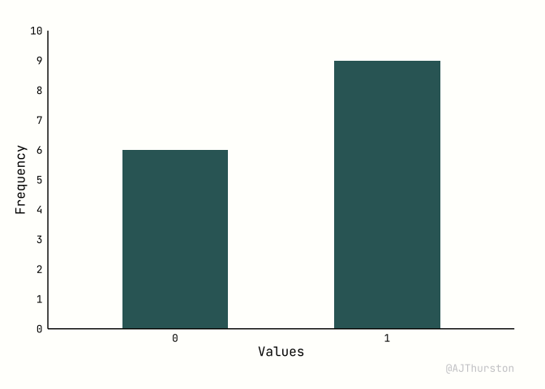

# Theme
AJ Thurston

## Setup

Note, theme_custom() is called from a redirect where the raw file path
from Github is:
https://raw.githubusercontent.com/AJThurston/dataviz/refs/heads/main/theme/theme.r

``` r
library(tidyverse)
library(ggplot2)
devtools::source_url("ajthurston.com/theme")
```

## Data

``` r
df <- data.frame(values = as.factor(c(rep(0,6),rep(1,9))))
```

## Plot

``` r
ggplot(df, aes(x = values)) +
  geom_bar(fill = "#336666", width = .5) +
  labs(x = "Values", y = "Frequency") +
  scale_y_continuous(limits = c(0,10), breaks = c(0:10), expand = c(0,0)) +
  theme_custom()
```


